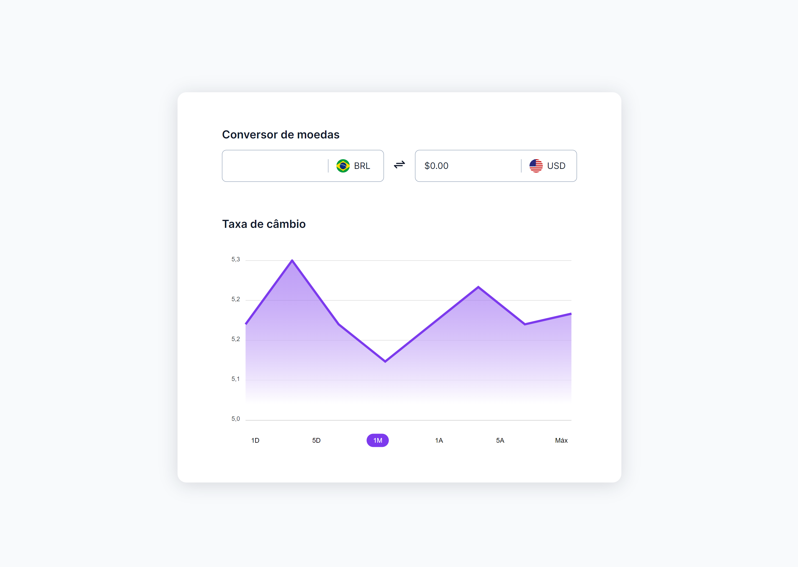

<h1 align="center"> Conversor de Moedas - BoraCodar#9 </h1>

[Clique aqui para acessar](https://maik-emanoel.github.io/currency-converter/)

## 🚀 Tecnologias

Esse projeto foi desenvolvido com as seguintes tecnologias:

- HTML
- CSS
- JavaScript
- Git and GitHub

## 💻 Projeto

Este conversor de moedas permite que o usuário calcule o valor atual do dólar em relação ao real, utilizando a taxa de câmbio mais recente.  

Obs: Projeto construído a partir do layout proposto no desafio [#BoraCodar9](https://boracodar.dev/) realizado pela [Rocketseat](https://rocketseat.com.br).  
Neste projeto utilizei promises do JavaScript para conseguir capturar o valor atual do dólar através de uma API.
